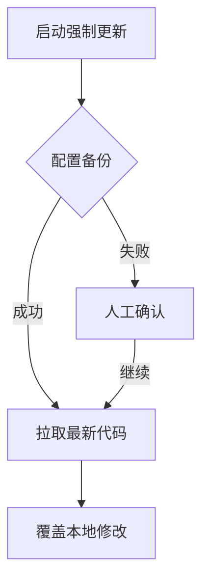

# 小智AI服务端一键更新脚本


专为小智AI ESP32服务端设计的智能更新工具，集成Git镜像加速、配置保护等实用功能，让版本更新更简单可靠。

## ✨ 核心功能

### 🌐 智能镜像加速
• 内置15个GitHub镜像代理源，自动解决`raw.githubusercontent.com`访问难题
• 支持一键切换/重置镜像源，拉取速度最高提升300%

### 🔒 配置安全保障
• 自动备份`data/.config.yaml`配置文件到独立目录
• 增量备份策略，保留历史版本可追溯

### ⚡ 双模更新引擎
1. **温柔模式**  
   保留本地修改，智能合并更新（`git pull`）
   
2. **强制模式**  
   彻底同步最新代码（`git reset --hard`），操作前需二次确认

### 🧩 开箱即用
• 内置Git 2.48.1运行环境
• 全中文交互界面，操作日志实时显示
• 跨平台支持（Windows优先适配）

## 🚀 使用指南

### 快速开始
需要配合一键包使用

首次提交，暂无操作演示

### 强制更新流程


## ⚠️ 注意事项
1. **重要数据保护**  
   强制更新前会自动备份，但仍建议手动备份`/src/main/xiaozhi-server/data`目录

2. **代理稳定性**  
   如遇代理失效，可通过以下命令重置：
   ```bash
   git remote set-url origin https://github.com/xinnan-tech/xiaozhi-esp32-server.git
   ```

## 📜 开源协议
本项目基于 [GNU GPL v3.0](https://www.gnu.org/licenses/gpl-3.0.html) 开源，欢迎二次开发但需保留原始版权声明。  
禁止删除**香草味的纳西妲喵**署名分发，违者追究法律责任！

---

> 📧 技术支持：首次提交，暂无
> 🌍 项目主页：首次提交，暂未填写
> 🛠️ 问题反馈：[GitHub Issues](https://github.com/NyaOH-Nahida/xiaozhi-server-updater/issues)
